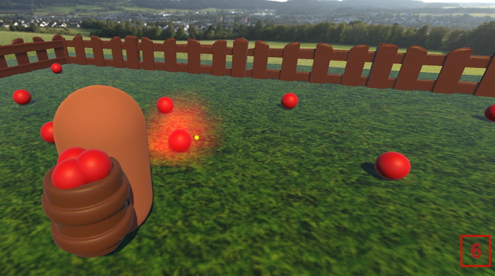

# Cena unity com RayCast
Cena feita utilizando RayCast por Cauã Silva e Pedro Ferraz

## Sobre a cena

Para aplicar o conceito do raycast, prefab e destroy, pensamos em fazer um personagem coletando itens ao clicar neles.

Os itens(frutas), vão aparecendo aleatoriamente na pequena área do mapa, e toda vez que o jogador clica nele, uma animação de partícula é ativada e depois de 2 segundos ele é destruído. Possui um contador que toda vez que coletar(destruir) um item, ele soma mais um.

Os itens vermelhos que estão no chão são os prefabs, junto com a bolsa do personagem.

Na cena adicionamos um cubemap skybox(fundo no cenário) que retrata uma área rural.

## Explicando os códigos
### RayCast

Atribuimos a biblioteca de UI que servirá para o nosso contador. A primeira varíavel "frutasPegas" é a quantidade de frutas que você clicou e destruiu, o audio é do som que faz ao coletar a fruta e o text é o texto da quantidade de frutas que aparece na tela. A baixo está as variáveis que serão utilizadas no RayCast, que é o ponto central da tela (direção que vai o raio).

Em seguida, bloqueamos o cursor no void Start(), e começamos o Update() adicionando o código que mostrará o contador de frutas pegas na tela.

A baixo começa o RayCast, onde primeiro temos uma condição que verifica se o botão esquerdo do mouse foi apertado. Se foi, um raio será lançado na direção do ponto que foi posicionado no centro da tela da camera, esse raio tem uma distância máxima de 20, então só conseguirá acertar o prefab(item) de uma distância específica.

Nos itens foram atribuidos as tags "Itens", se o raio atingir um item com essa tag, o objeto é destruido após um atraso de 2 segundos, será explicado logo em seguida.

O IEnumerator define o atraso, ele recebe o parâmetro do alvo que será destruido e do tempo de delay(atraso).

A baixo será pego a função de particulas do item, e na condição (if) logo em seguida diz que se ele for encontrado, tudo que estiver dentro dela será executado. Irá desabilitar o colisor do item, iniciar a animação da partícula, iniciar o som de coleta do item, somar mais um no contador de frutas pegas e por fim o código responsável por pausar a execução da função pelo período de tempo atribuido a delay, quando acabar o item será destruido.

### Spawnar frutas

Adicionamos diversos GameObject vazios pela cena, que serão utilizados de spawn point(onde as frutas irão aparecer com o tempo). No começo do código iremos pegar esses spawns e logo em seguida o prefab do item(fruta).

Dentro do void Start() está o código responsável por invocar os items, onde o número 1 representa o tempo de spawn do primeiro item, e 3, o tempo de spawn dos itens seguintes, dentro deles chamamos a função SpawnFruta. Nessa função é selecionado um spawn aleatório, onde nele será instanciado um item com a tag "Itens".

## Vídeo mostrando a cena
https://github.com/CauaSilva28/Atividade-Cena-RayCast/assets/127631052/2bb850d6-48bf-488d-aa27-81d3734d9826
